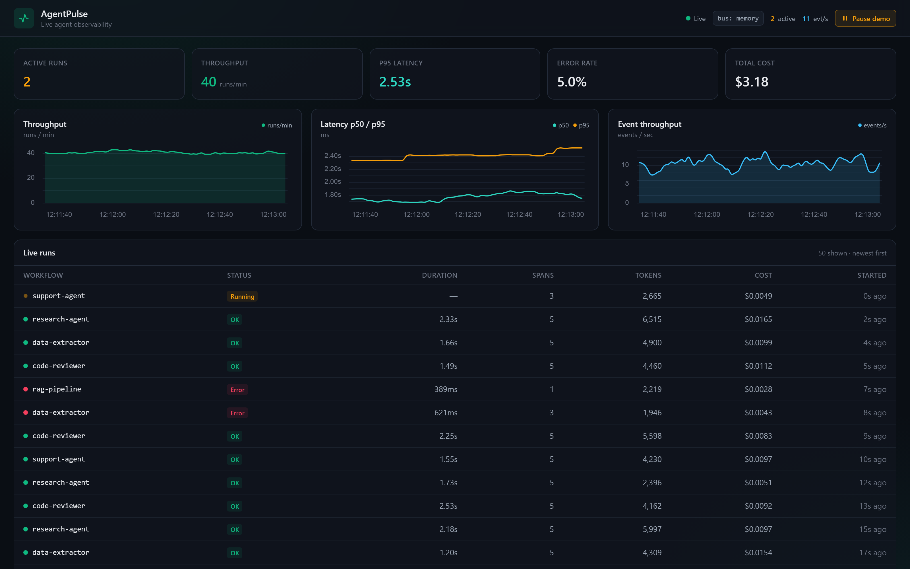
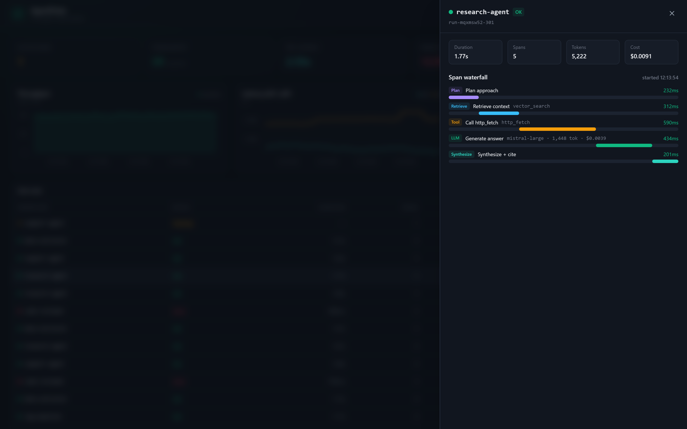
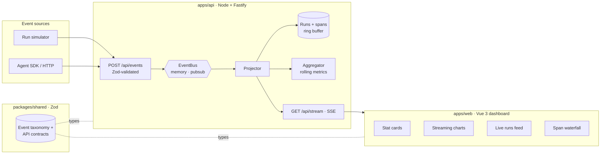

# AgentPulse


> Point your agents at AgentPulse and watch every run stream in live — traces,
> tool calls, tokens, cost, latency, errors — on a dashboard fed by an **event
> bus** that runs in-memory offline and swaps to **GCP Pub/Sub** with one env var.



A real-time, **event-driven observability dashboard for agentic systems**. Agents
emit OpenTelemetry-flavored events as they run; AgentPulse ingests them onto an
event bus, projects them into live runs and spans, rolls up throughput / latency
percentiles / token-cost / error-rate, and streams the whole thing to a **Vue 3**
dashboard over SSE. A built-in traffic **simulator** means it runs end-to-end
offline with zero credentials.

Built deliberately on a modern agentic-platform stack: **Vue 3 + TypeScript
(strict)**, **Node.js + TypeScript**, **Fastify**, **Zod** schema contracts, an
**event bus** with in-memory and **Google Cloud Pub/Sub** adapters, and
**@unovis/vue** for streaming charts.

---

## Why this project

It exercises the exact problems a frontier-AI platform team faces:

| Challenge                                         | How this repo answers it                                                                                                     |
| ------------------------------------------------- | ---------------------------------------------------------------------------------------------------------------------------- |
| **Architecting resilient, event-driven services** | An `EventBus` abstraction (`publish` / `subscribe`) with **in-memory** and **GCP Pub/Sub** adapters, selected by one env var |
| **Defining the language between agents & humans** | A single `@pulse/shared` package of **Zod event-taxonomy + API contracts** consumed by producer, aggregator, SSE, and UI     |
| **Observability as a product**                    | Rolling throughput, p50/p95 latency, error rate, token & cost — plus per-run **span waterfalls** for trace drilldown         |
| **High-craft, data-dense frontend**               | A **Vue 3** dashboard: live stat cards, streaming time-series charts, a runs feed, and an interactive span-waterfall drawer  |
| **Streaming UX**                                  | Server-Sent Events fan-out with snapshot hydration; the dashboard is live within one frame of connecting                     |

## Span waterfall

Click any run to open its trace — each span (plan → retrieve → tool → llm →
synthesize) positioned on a real timeline with per-span duration, model, tokens,
cost, and surfaced errors.



## Tech stack

| Layer       | Technology                                                                                                       |
| ----------- | ---------------------------------------------------------------------------------------------------------------- |
| Frontend    | **Vue 3** (Composition API, `<script setup>`), **TypeScript strict**, Vite, Pinia, **@unovis/vue**, Tailwind CSS |
| Backend     | **Node.js + TypeScript** (ESM, strict), **Fastify**, Server-Sent Events                                          |
| Event bus   | `EventBus` interface → **in-memory** (default) or **Google Cloud Pub/Sub** (`@google-cloud/pubsub`)              |
| Aggregation | Rolling window: throughput, p50/p95 (linear-interpolation percentile), token/cost, error rate                    |
| Contracts   | **Zod** event taxonomy + API schemas shared across the stack (`@pulse/shared`)                                   |
| Tooling     | npm workspaces, ESLint (flat), Prettier, Vitest, Docker, GitHub Actions CI                                       |

> **Runs fully offline.** The default in-memory bus plus a built-in simulator
> emit realistic synthetic traffic (believable latency spread, ~6% error rate,
> per-model token/cost) — so you can clone, install, and watch a live dashboard
> with **zero API keys or cloud setup**. Set `BUS_DRIVER=pubsub` to route the
> same events through Google Cloud Pub/Sub.

---

## Architecture



The pipeline: `ingest → bus → projector → (store + aggregator + SSE) → dashboard`.
The `EventBus` is the only seam that changes between local and cloud — everything
downstream is identical. See [`docs/ARCHITECTURE.md`](docs/ARCHITECTURE.md) for the
deep dive.

## Event taxonomy

OpenTelemetry-flavored, defined once in `@pulse/shared` as a Zod discriminated
union and consumed everywhere:

```
run.started · span.started · tool.called · llm.usage · span.ended · run.ended · log
```

## Monorepo layout

```
agentpulse/
├── apps/
│   ├── api/        # Node + TS + Fastify · ingest, EventBus, aggregator, SSE, simulator
│   └── web/        # Vue 3 + TS · dashboard, charts, runs feed, span waterfall
├── packages/
│   └── shared/     # Zod event taxonomy + API contracts (@pulse/shared)
├── docs/           # architecture + screenshots
├── docker-compose.yml
└── .github/        # CI
```

## Quickstart

```bash
git clone https://github.com/soneeee22000/agentpulse.git
cd agentpulse
npm install

# Terminal 1 — API (in-memory bus + simulator, no keys needed)
npm run dev:api          # http://localhost:8080

# Terminal 2 — Web
npm run dev:web          # http://localhost:3000
```

Open the dashboard — the simulator is already streaming traffic. Toggle it with
the **Start/Pause demo** button, and click any run to open its span waterfall.

Drive traffic through the real HTTP ingest path instead of the in-process sim:

```bash
npm run sim              # streams synthetic runs to POST /api/events
```

### Route events through Google Cloud Pub/Sub

```bash
export BUS_DRIVER=pubsub
export GCP_PROJECT_ID=your-project
export PUBSUB_TOPIC=agentpulse-events
export PUBSUB_SUBSCRIPTION=agentpulse-events-sub
npm run dev:api
```

> The Pub/Sub adapter is real, reviewable code; the demo runs the in-memory bus.
> The repo is **GCP-ready**, not a hosted deployment.

### Docker

```bash
docker compose up --build           # web :3000, api :8080
```

## Scripts

| Command                           | Description                         |
| --------------------------------- | ----------------------------------- |
| `npm run dev`                     | Run API + web together              |
| `npm run build`                   | Build shared → api → web            |
| `npm run typecheck`               | Strict typecheck across workspaces  |
| `npm test`                        | Run all Vitest suites               |
| `npm run lint` / `npm run format` | ESLint / Prettier                   |
| `npm run sim`                     | Stream synthetic traffic to the API |

## Quality gates

Strict TypeScript everywhere · Zod-validated boundaries · Vitest unit
(aggregator percentiles, bus fan-out, run projection) + component (span
waterfall) tests · ESLint (flat) + Prettier · CI builds, typechecks, lints, and
tests on every push.

## License

[MIT](LICENSE) © Pyae Sone (Seon) — [github.com/soneeee22000](https://github.com/soneeee22000)
