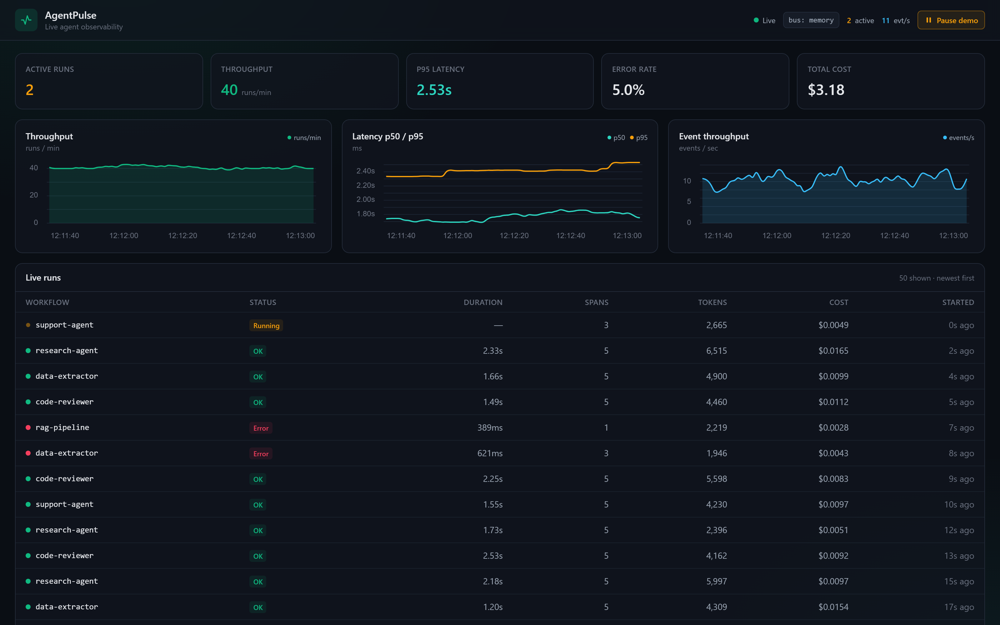
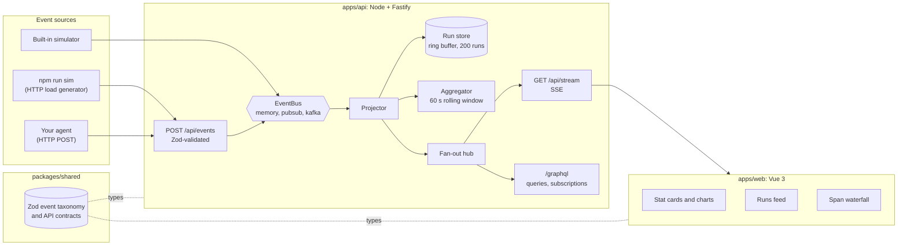
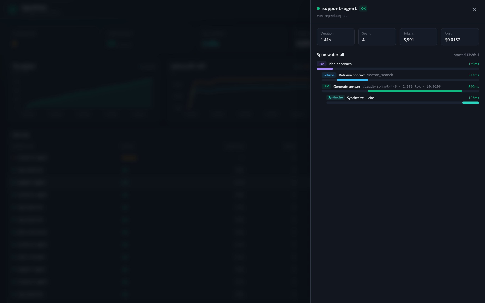

# AgentPulse

A real-time, event-driven observability dashboard for agent runs: traces, tool calls, tokens, cost, latency and errors, streamed live from a swappable event bus.

[](https://github.com/soneeee22000/agentpulse/actions/workflows/ci.yml)
[](package.json)
[](tsconfig.base.json)
[](apps/web/package.json)
[](eslint.config.js)
[](LICENSE)
[](https://github.com/soneeee22000/agentpulse/commits/main)



**[Live demo](https://agentpulse-web-171722935814.europe-west1.run.app)** · [GraphiQL](https://agentpulse-api-171722935814.europe-west1.run.app/graphiql) · [API health](https://agentpulse-api-171722935814.europe-west1.run.app/api/health) · [Architecture](docs/ARCHITECTURE.md) · [Why this exists](docs/WHY.md)

The live demo is the real app (API and dashboard) running on Google Cloud Run with the in-memory bus and no API keys. **The traffic you see comes from the built-in simulator, not from real agents.** The services scale to zero, so the first request after an idle period is slow and can briefly return a Cloud Run error page; reload after a few seconds.

## Why this exists

**Agent runs fail in the middle.** A multi-step agent plans, retrieves, calls tools and calls one or more models. When a run is slow, expensive or wrong, a final status code says nothing about which step caused it. You need the span tree of that run, with timing, tokens, cost and the error, and you need it while the system is running, not in tomorrow's log export.

**The transport should not dictate the app.** A laptop demo wants zero setup; a real deployment wants a durable, decoupled log that several consumers can read. AgentPulse keeps the whole pipeline behind one `EventBus` interface, so the same projector, store, metrics and dashboard run on an in-memory bus, Google Cloud Pub/Sub or Kafka, selected by one environment variable.

**One contract for every hop.** The event taxonomy and the API shapes are defined once as Zod schemas in `@pulse/shared`. The ingest route, the projector, the SSE serializer and the Vue store all validate against the same schemas, so the producer and the dashboard cannot drift apart. More in [docs/WHY.md](docs/WHY.md).

## What it solves

| Layer          | Problem                                                               | How AgentPulse answers it                                                                                                                    |
| -------------- | --------------------------------------------------------------------- | -------------------------------------------------------------------------------------------------------------------------------------------- |
| **Contract**   | Producers and consumers of agent events drift apart.                  | A Zod discriminated union of seven event types in `packages/shared`, re-validated at ingest and again in the browser.                        |
| **Transport**  | A local demo and a real deployment need different transports.         | `EventBus` with in-memory, Pub/Sub and Kafka drivers (`apps/api/src/bus/`). Nothing downstream knows which one is active.                    |
| **Read model** | Raw events are not answers: you want runs, spans and rolling numbers. | A projector folds events into a bounded run store (span trees) and a 60 s rolling aggregator: throughput, p50/p95 latency, error rate, cost. |
| **Delivery**   | Dashboards that poll are late and wasteful.                           | Server-Sent Events with a hydrating snapshot, plus a GraphQL API with WebSocket subscriptions fed by the same fan-out hub.                   |
| **View**       | A failing run hides which step failed.                                | A Vue 3 dashboard with a per-run span waterfall: each span on a real timeline with duration, model, tokens, cost and the surfaced error.     |

## Architecture


```mermaid
flowchart LR
  subgraph Sources["Event sources"]
    Sim["Built-in simulator"]
    Cli["npm run sim<br/>(HTTP load generator)"]
    Agent["Your agent<br/>(HTTP POST)"]
  end

  subgraph API["apps/api: Node + Fastify"]
    Ingest["POST /api/events<br/>Zod-validated"]
    Bus{{"EventBus<br/>memory, pubsub, kafka"}}
    Proj["Projector"]
    Store[("Run store<br/>ring buffer, 200 runs")]
    Agg["Aggregator<br/>60 s rolling window"]
    Hub["Fan-out hub"]
    Sse["GET /api/stream<br/>SSE"]
    Gql["/graphql<br/>queries, subscriptions"]
  end

  subgraph Shared["packages/shared"]
    Tax[("Zod event taxonomy<br/>and API contracts")]
  end

  subgraph Web["apps/web: Vue 3"]
    Cards["Stat cards and charts"]
    Feed["Runs feed"]
    Trace["Span waterfall"]
  end

  Sim --> Bus
  Cli & Agent --> Ingest --> Bus --> Proj
  Proj --> Store & Agg & Hub
  Hub --> Sse & Gql
  Sse --> Web
  Tax -. types .- API
  Tax -. types .- Web
```

The pipeline is `ingest → bus → projector → (store + aggregator + fan-out) → dashboard`. The `EventBus` is the only seam that changes between local and cloud. The deep dive is in [docs/ARCHITECTURE.md](docs/ARCHITECTURE.md).

## Features

| Feature           | Where                                       | Notes                                                                                                                                        |
| ----------------- | ------------------------------------------- | -------------------------------------------------------------------------------------------------------------------------------------------- |
| Event taxonomy    | `packages/shared/src/events.ts`             | `run.started`, `span.started`, `tool.called`, `llm.usage`, `span.ended`, `run.ended`, `log`. OpenTelemetry-flavoured, not OTLP.              |
| Swappable bus     | `apps/api/src/bus/`                         | `BUS_DRIVER=memory` (default), `pubsub` or `kafka`. Kafka messages are keyed by `runId`, so a run's events stay in order.                    |
| Rolling metrics   | `apps/api/src/metrics/`                     | Throughput per minute, p50/p95 (linear-interpolation percentile), error rate, events per second, cumulative tokens and cost.                 |
| SSE stream        | `apps/api/src/routes/index.ts`              | A snapshot on connect, then run deltas, events and a metrics tick every second.                                                              |
| GraphQL           | `apps/api/src/graphql/`                     | Mercurius, with GraphiQL. `Run.spans` is a field resolver, so listing runs never loads span trees.                                           |
| Span waterfall    | `apps/web/src/components/SpanWaterfall.vue` | Click a run to see plan, retrieve, tool, llm and synthesize spans on one timeline.                                                           |
| Keyless simulator | `apps/api/src/sim/simulator.ts`             | Five workflow names, four model price profiles, five tool names, about 6% of runs fail at one random step. Starts on boot (`SIM_AUTOSTART`). |



## Results

There is no benchmark here: AgentPulse is a dashboard, and every number it shows in the demo comes from simulated traffic. What can be checked is that the code works and that the deployment is up.

- **Tests:** 76 Vitest tests in 11 files, all passing (`npm test`, run locally on 2026-09-24): 7 in `packages/shared` (contracts), 54 in `apps/api` (percentiles, window eviction, run projection, the three bus drivers, with Pub/Sub and Kafka against mocked clients, GraphQL queries and mutations, the subscription event iterator) and 15 in `apps/web` (formatters, span waterfall).
- **Checks:** `npm run lint`, `npm run typecheck` and `npm run build` pass. CI runs all four on every push (`.github/workflows/ci.yml`).
- **Deployment:** on 2026-09-24 the dashboard returned 200 with the title "AgentPulse", GraphiQL returned 200, and `/api/health` returned `{"status":"ok","busDriver":"memory",...,"simRunning":true}`. The first request, against cold instances, returned a Cloud Run 500 page; the retries returned 200.
- **Subscriptions:** `npm run smoke:subscription` checks that live events arrive over `graphql-transport-ws` against a running API.

## Getting started

Requires Node.js 20 or newer.

```bash
git clone https://github.com/soneeee22000/agentpulse.git
cd agentpulse
npm install

npm run dev:api          # terminal 1: API on http://localhost:8080, in-memory bus, simulator on
npm run dev:web          # terminal 2: dashboard on http://localhost:3000
```

The simulator is already streaming when the dashboard opens. **Start/Pause demo** toggles it; click any run to open its span waterfall. To drive traffic through the real HTTP ingest path instead:

```bash
npm run sim              # streams synthetic runs to POST /api/events
```

Route the same events through Kafka (a single-node Redpanda broker ships behind a compose profile):

```bash
docker compose --profile kafka up -d kafka
BUS_DRIVER=kafka npm run dev:api
```

Or through Google Cloud Pub/Sub (needs a GCP project, topic and subscription):

```bash
BUS_DRIVER=pubsub GCP_PROJECT_ID=your-project \
PUBSUB_TOPIC=agentpulse-events PUBSUB_SUBSCRIPTION=agentpulse-events-sub \
npm run dev:api
```

Query it at `http://localhost:8080/graphiql`:

```graphql
{
  runs(limit: 5, status: error) {
    total
    runs {
      runId
      workflow
      durationMs
      spans {
        spanId
        kind
        status
      }
    }
  }
}
```

Everything in containers: `docker compose up --build` (web on 3000, API on 8080).

| Command                           | What it does                             |
| --------------------------------- | ---------------------------------------- |
| `npm run dev`                     | API and web together                     |
| `npm run build`                   | Build shared, then API, then web         |
| `npm run typecheck`               | Strict typecheck across workspaces       |
| `npm test`                        | All Vitest suites                        |
| `npm run lint` / `npm run format` | ESLint / Prettier                        |
| `npm run sim`                     | Stream synthetic traffic to the API      |
| `npm run smoke:subscription`      | Check live GraphQL subscription delivery |

## Project structure

```
agentpulse/
├── apps/
│   ├── api/        Fastify + TS: ingest, EventBus drivers, projector, store, aggregator, SSE, GraphQL, simulator
│   └── web/        Vue 3 + TS: stat cards, streaming charts, runs feed, span waterfall
├── packages/
│   └── shared/     Zod event taxonomy and API contracts (@pulse/shared)
├── scripts/        smoke-subscription.mjs
├── docs/           ARCHITECTURE, WHY, screenshots
├── docker-compose.yml
└── .github/        CI
```

## Limitations

- **It observes agent runs; it does not orchestrate them.** AgentPulse runs no agents, plans no steps and retries nothing. It only receives events that something else emits.
- **The demo traffic is simulated.** Unless real agents are pointed at `POST /api/events`, every run, token count, cost and error on the dashboard comes from the built-in simulator. The model names and prices in it are illustrative profiles, not measured usage.
- **There is no agent SDK.** An agent reports by posting events that match the Zod schema over HTTP (or the GraphQL `ingest` mutation). The events are OpenTelemetry-flavoured, but AgentPulse does not accept OTLP.
- **Cold starts.** Both Cloud Run services scale to zero. The first request after an idle period is slow and can return a Cloud Run 500 page before the instance is ready.
- **State lives in memory.** Runs sit in a 200-run ring buffer and metrics in a 60 s window. A restart or a scale-to-zero wipes them, and with the in-memory bus each instance holds its own view.
- **The deployed demo uses the in-memory bus.** The Pub/Sub and Kafka drivers are real code with tests, and Kafka runs locally via compose, but neither is deployed.
- **No authentication.** Ingest, the simulator toggle and GraphQL are open, and CORS defaults to `*`. It is a public demo, not a multi-tenant service.
- **A portfolio piece, not a product.** See [what this is not](docs/WHY.md#what-this-is-not).

## Roadmap

1. A thin TypeScript client that wraps an agent's steps and emits the taxonomy, so reporting is not hand-written HTTP.
2. OTLP ingest, so agents already instrumented with OpenTelemetry can report without changes.
3. A durable store behind the projector, so runs survive restarts and several instances share one view.
4. Authentication on ingest and on the simulator controls.

## License

[MIT](LICENSE)

## Author

**Pyae Sone (Seon)** · [github.com/soneeee22000](https://github.com/soneeee22000)
